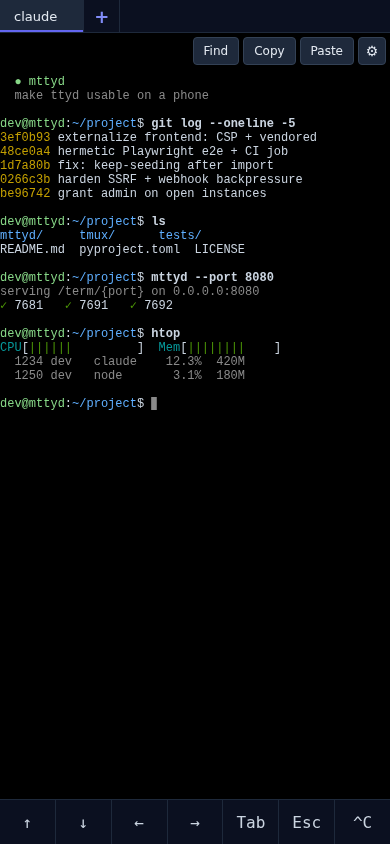

# mttyd

Make [ttyd](https://github.com/tsl0922/ttyd) usable on a phone.

A tiny HTTP server that wraps any ttyd-backed terminal in a mobile-friendly
page: proper viewport, smooth touch scroll with momentum, a key bar for
the arrows / Tab / Esc / Ctrl-C your phone keyboard hides, copy/paste,
search through scrollback, themes, and a settings drawer to toggle it all.

<p align="center">
  
</p>

## Why

ttyd's own HTML works great on desktop. On a phone it falls apart:

| Problem | Why | mttyd's fix |
|---|---|---|
| Text looks weirdly small or huge | ttyd's index page has no mobile viewport, so phones render it at 980 px CSS and zoom out | Wrapper page sets `<meta name="viewport" content="width=device-width">` so font sizes mean what they say |
| Scroll doesn't work / pulls to refresh | xterm.js v5 doesn't translate touch into wheel events; the browser interprets a downward drag as pull-to-refresh and reloads the page | Pointer-event handler with `setPointerCapture`, anchored math, and friction-based momentum; `touch-action: none` on body kills pull-to-refresh |
| Android autocorrect inserts duplicate words | Gboard's predictive strip runs on xterm.js's hidden helper textarea | `inputmode="url"` + autocomplete/autocorrect/spellcheck off + a MutationObserver that re-applies the attrs if xterm.js ever resets them |
| Can't type arrows, Tab, Esc, Ctrl-C | Phone keyboards either lack these keys or hide them several taps deep | Bottom key bar with all of them; long-press for secondary keys (PgUp/PgDn/Home/End/Shift-Tab/Ctrl-D) |
| Reattaching to tmux shows empty scrollback | xterm.js's buffer starts empty per tab; tmux history isn't replayed | Optional wrapper script runs `tmux capture-pane -S -100000` before attach |
| Can't scroll up in full-screen TUIs (Claude Code, htop, less, vim) | TUIs with mouse tracking redraw in place — nothing ever enters xterm.js scrollback, so a local scroll has nothing to move | When the foreground app has mouse tracking on, touch-drag is forwarded as wheel events, so the app scrolls its **own** content; plain shells keep the local smooth scroll |
| Tmux alt-screen hides TUI history | Default tmux config | Recommended config disables it |

## Features

- **Smooth touch scroll** with momentum (Pointer Events + `setPointerCapture`, no event coalescing)
- **Key bar**: ↑ ↓ ← → Tab Esc ^C — long-press for PgUp/PgDn/Home/End/Shift-Tab/^D (haptic on long-press)
- **Top toolbar**: Find · Copy · Paste · Hist · ⚙
  - **Find** uses `@xterm/addon-search` for incremental search with highlights
  - **Copy** writes the current xterm.js selection to the system clipboard
  - **Paste** sends clipboard contents to the terminal as if typed
  - **Hist** toggles a row of ranked bash-history suggestions
    (`/api/term/history`, frequency + recency); tapping one types the
    command into the terminal — you still press Enter to run it
- **Settings drawer** (gear icon): font size, theme, per-feature toggles, snippet editor
- **5 themes**: Dark · Light · Solarized Dark · Dracula · Nord
- **Snippets bar**: optional horizontal row of one-tap commands (`label|command`, one per line)
- **Wake lock**: keeps the screen on while terminal is open; auto-releases when backgrounded
- **Auto-reconnect**: on WS close, retries 3× with exponential backoff (1s/2s/4s), then shows a manual reconnect button
- **Android Gboard fix**: hidden helper textarea attributes locked via MutationObserver

All settings persist to `localStorage` per-port and survive reload.

## Quick start

```bash
pip install mttyd

# in one shell: start ttyd on some port
ttyd -p 7681 -W tmux new-session -A -s main

# in another: point mttyd at it
mttyd --config mttyd.yaml --port 8080
```

`mttyd.yaml`:
```yaml
ports:
  7681:
    history: { file: ~/.bash_history }
```

Open `http://your-server:8080/term/7681` on your phone. (Or `--config`-less
for a single LAN box — see below.)

The page is a single HTML document. xterm.js + FitAddon + SearchAddon are
vendored inside the package (pinned upstream builds under
`mttyd/static/vendor/`, served at `/static/vendor/…`), so everything works
on an offline LAN and nothing loads from a CDN. The WebSocket connects
directly to ttyd at `ws://host:7681/ws`; mttyd only ever serves the wrapper
page, its static assets, and the optional bash-history endpoint.

## Multi-tab (one page, multiple terminals)

If you have several ttyd ports — say one per machine — point the URL at a
comma-separated list:

```
http://your-server:8080/term/7681,7691,7692
```

You get a tab bar across the top, one tab per port. Each tab is its own
live xterm + WebSocket, so background tabs keep receiving output and a
small `•` dot lights up on their tab button when there's new content.
Tap a tab to switch; the active port is reflected in the URL hash
(`#7691`) so the tab survives a reload and is bookmarkable.

- Single-port URL (`/term/7681`) still works — the tab bar just hides.
- Each port must be in your `mttyd.yaml` (or any port if config-less).
- Settings (font, theme, key bar, snippets, etc.) are shared across all
  tabs in the page.

## Parallel sessions on one port (the "multiple claudes" mode)

If the ttyd port runs a wrapper like `pwa-claude-tmux` that attaches to a
named tmux session, mttyd's `+` button lets you spawn extra parallel
sessions and switch between them — useful for running, say, three Claude
conversations on different projects at the same time.

### Setup

**1. Make your wrapper script take the session name as `$1`.** Example
`pwa-claude-tmux` (the one shipped in `tmux/pwa-claude-tmux`):

```bash
#!/bin/bash
SESSION="${1:-${SESSION:-claude}}"           # first arg wins, default "claude"
SESSION=$(echo "$SESSION" | tr -cd 'a-zA-Z0-9_-')   # sanitize
[ -z "$SESSION" ] && SESSION=claude
# ... attach tmux session named $SESSION ...
```

**2. Start ttyd with `--url-arg`** so the page can pass a session name as
a query string:

```bash
ttyd --port 7691 --writable --url-arg /path/to/pwa-claude-tmux
```

That's it. Now:

- `/term/7691` opens with one tab connected to the default session (`claude`).
- The `+` button in the tab bar spawns a new tab connecting to
  `ws://host:7691/ws?arg=claude-2`. ttyd passes `claude-2` to the wrapper,
  which attaches to (or creates) a tmux session by that name.
- The `×` on each extra tab calls `POST /api/term/kill?session=NAME` —
  mttyd runs `tmux kill-session -t NAME` so closed claudes don't pile up.
  Reserved session names (`claude`, `main`, `default`) are refused so you
  can't accidentally kill your primary, and only sessions under the
  `claude-` prefix (configurable via `MTTYD_KILL_PREFIX`, optionally
  token-gated via `MTTYD_KILL_TOKEN`) are killable — see the security
  note under [Endpoints](#endpoints).
- Extra tabs persist in localStorage per-port — next visit restores them.

Security: `--url-arg` lets any client pass arbitrary command-line args to
the inner program. Only enable it on ttyd entries whose command is a
wrapper script that sanitizes its args (the shipped `pwa-claude-tmux`
does this). Don't put `--url-arg` on a raw `ssh` or `bash` invocation.

## Configuration

Each port entry in `mttyd.yaml` declares one of:

- `history: { file: /path/to/.bash_history }` — read a local file
- `history: { ssh: user@host, path: ~/.bash_history }` — pull over SSH (uses your agent / keys)

SSH sources run non-interactively (`BatchMode=yes`) with
`StrictHostKeyChecking=accept-new`: unknown hosts are trusted on first
use, but a **changed** host key is refused instead of silently accepted.
Set `MTTYD_SSH_STRICT_HOST_KEY_CHECKING` (`yes` / `no` / `accept-new` /
`ask`) in mttyd's environment to override — e.g. `yes` if you pre-populate
`known_hosts` and want unknown hosts refused too.

Ports not listed return 404 from `/term/{port}`. That's the access-control
mechanism — keep the file tight.

Config-less mode (`mttyd` with no `--config`) skips the whitelist and serves
the wrapper for any port, with no history endpoint. Fine for one-off LAN
setups; **don't expose it to the public internet that way.**

## Persistent sessions (the Claude+tmux mode)

The repo includes `tmux/pwa-claude-tmux`, a wrapper script that:

- attaches to (or creates) a named tmux session
- dumps the existing scrollback into stdout before attaching, so xterm.js
  lands with the full conversation history
- runs a long-running command inside, with auto-respawn

Default command is `claude --dangerously-skip-permissions`, but it's just
two env vars:

```bash
cp tmux/pwa-claude-tmux tmux/pwa-claude-inner.sh ~/.local/bin/
chmod +x ~/.local/bin/pwa-claude-tmux ~/.local/bin/pwa-claude-inner.sh

# Claude (default):
ttyd -p 7691 -W ~/.local/bin/pwa-claude-tmux

# Anything else:
MTTYD_CMD="htop" MTTYD_SESSION="htop" \
  ttyd -p 7692 -W ~/.local/bin/pwa-claude-tmux
```

Append `tmux/tmux.conf` to your `~/.tmux.conf` for the matching tmux side
(mouse off to avoid copy-mode trap on phone, alt-screen disabled, big
history-limit).

## Endpoints

| Method | Path | Returns |
|---|---|---|
| GET | `/term/{port}` | HTML wrapper page (404 if port not in config) |
| GET | `/api/term/history?port=N` | `{commands: [...], cached: bool}` — feeds the page's **Hist** suggestions row |
| POST | `/api/term/kill?session=NAME` | `{killed: bool, session, error}` — runs `tmux kill-session -t NAME` |
| GET | `/healthz` | `{ok: true, ports: [...]}` |

**Security note on `/api/term/kill`:** it's a state-changing endpoint, so
it's locked down in three ways. Session names must match `[a-zA-Z0-9_-]`,
reserved names (`claude`, `main`, `default`) are always refused, and only
sessions starting with the allowed prefix are killable — `claude-` by
default (what the page's `+` button generates), overridable with
`MTTYD_KILL_PREFIX`. For anything beyond a trusted LAN, also set
`MTTYD_KILL_TOKEN` in mttyd's environment: requests must then send it in
an `X-Mttyd-Token` header (custom headers can't be produced by cross-site
form posts, so this doubles as a CSRF guard).

## Tests

```bash
pip install -e '.[test]'
pytest
```

### Browser end-to-end (Playwright)

`tests/test_e2e_playwright.py` drives a headless Chromium (via
`pytest-playwright`) against a *real* mttyd server started on an ephemeral
port — a throwaway WebSocket server stands in for ttyd so the page's per-tab
socket actually connects. The tests assert the page renders xterm, boots
exactly one session, exposes the tab-management API, shows the toolbar
buttons, handles single/multi-port and invalid-port URLs, and — as a
regression guard for the `lockHelperAttrs`/MutationObserver infinite loop —
confirm the event loop isn't CPU-pinned at init (a 250 ms timer resolves
promptly and session 0's WebSocket is OPEN/CONNECTING).

They're tagged with the `e2e` marker and **deselected by default**, so the
plain `pytest` run above stays fast and offline. To run them:

```bash
pip install -e '.[e2e]'
playwright install chromium      # one-time browser download
pytest -m e2e
```

(xterm.js and its addons are vendored into the package, so once Chromium is
installed the e2e run works fully offline.)

## License

[MIT](LICENSE)
